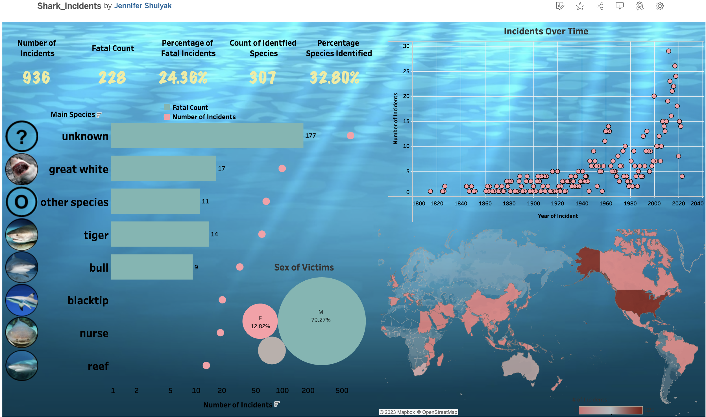

# shark_attacks
______________________________________________________________________________

## Purpose:

Sharks have been a target of fascination and fear for milennia. Incidents involving sharks are often reported and the danger they pose to humans is highly relevant as society activitely interacts with shark habitats. A goal of this project was to identify trends in shark encountours. The number of sharks positively identified as bull sharks and bull shark encountours overall were expected to rise as discoveries in the last ten years indicated that bull sharks were able to live in freshwaterways and have high levels of testosterone.  

This dataset lacked uniformity and standardization. One goal of picking this dataset was to practice normalizing difficult datasets. 

https://www.floridamuseum.ufl.edu/discover-fish/species-profiles/carcharhinus-leucas/
______________________________________________________________________________

## Methodology:
### Project Directory Layout

    ├── Resources               # Datasource .csv from Kaggle and JSON files stored here for endpoints.
    │   ├── shark_clean.csv     # Shark data ready for Tableau
    │   ├── type_invalid.csv    # Shark data labeled as "Invalid"
    ├── sharkETL.ipynb          # Python Script for extracting, transforming, and loading data  
    ├── SharkButtons            # Image files created for Tableau Dashboard
    ├── TableauDashboard.png    # Image of Tableau Dashboard
    └── README.md               # Readme File
    
 ### Data Source:
 
 Shark Attack dataset found on OpenDataSoft.
 Wrote HTTP requests to OpenDataSoft API endpoint to retrieve 1000 random shark attack incidents.   
 
 ### Procedure:
 
 1. Grabbed desired data using HTTP request and converted dataset into a Pandas Dataframe.
 2. Cut unnecessary fields and performed initial investigation of the data.
 3. Cleaned the dataset:

    a. Cleaned up species: Filled NaN's with "unknown". Looked at unique species listed and compile them into a list. 
       Next, took care of the great white shark using a function and regex to go through possible pseudonames for the Great White while also protected the Whitetip Shark (Great Whites are commonly referred to as White Sharks in Australia and New Zealand). All references to Great Whites were relabeled as "great white'. Then, wrote and applied function to go through the rest of the species column to relabel sharks as a species or as "unknown." Many entries had simply been size desciptions. 
       
    b. Cleaned up countries: Made all countries uppcase in order to make them uniform
    
    c. Cleaned up type: Types included 'Unprovoked', 'Questionable', 'Watercraft', 'Provoked', 'Invalid',
       'Sea Disaster', 'Boat', nan. Investigated 'Questionable' and 'Invalid' types to remove cases where there were not actually shark involvement or was labeled as "unlikely."
       
    d. Cleaned up Fatal: Wrote and applied function to go through and normalize the entries for the Fatal_y_n column. Forced the entries to be either "Y", "N", or "U" (unknown). 
    
    e. Cleaned up time: 5 bins were created to sort the incidents' time of day. Time entries were extremely dirty and ununiformed, so an intial filter function was written and applied to identify and take care all possible formats. Then sorting function was written and applied to normalize the data. 
    
    f. Looked into extracting the exact time from the case numbers. Tried applying cleaning function to case numbers data, but found that the case numbers were not all based on the date and time of the incident. Endeavor was determined to be futile. 
    
    g. Cleaned up sex: Sorting function written and applied to clean up the entries for the sex of the "victims."
    
 4. Exported the dataset as CSV.
 5. Interactive Tableau Dashboard created. Click on the shark buttons to look at information about the main species identified in incidents.
 ______________________________________________________________________________
 
  ## Dashboard:
  
  https://public.tableau.com/app/profile/jennifer.shulyak/viz/Shark_Incidents/Dashboard1
  
  
  
  _____________________________________________________________________________
  
  ## Analysis: 

* Only 32.8% of shark encountours result in the shark being positively identified. Shark identification will likely increase as technology advances such as video recording. 
* 24.6% of reported shark encountours result in a fatality. 
* At 79.27%, a vast majority of shark incidents involve male victims, regardless of shark species. This can be partially due to societal and economic gender roles where males are more likely to be involved in fishing.
* The number of incidents per year has increased exponentially. This could be due to an increase in reporting, technology, human population,  shark identification, etc. The majority of the incidents occur in the United States which is likely due to the large population, especially living along the coasts, technology, and beach destinations. The number of incidents per year will likely continue to increase as more of the world becomes more techinologically advanced, economically stable, and populations increase. 
* The increase in encontours
